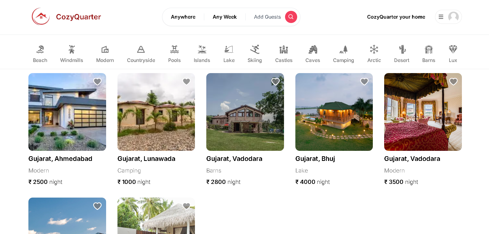
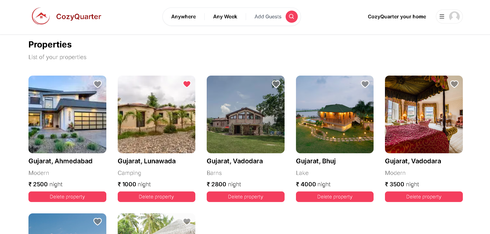
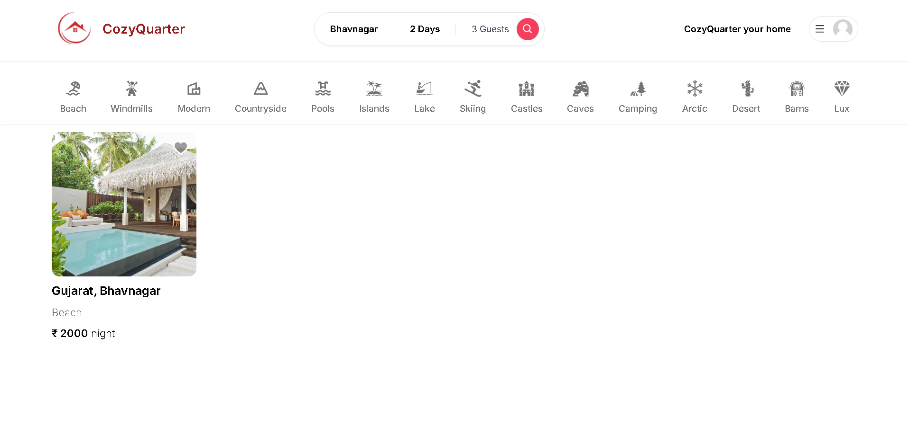
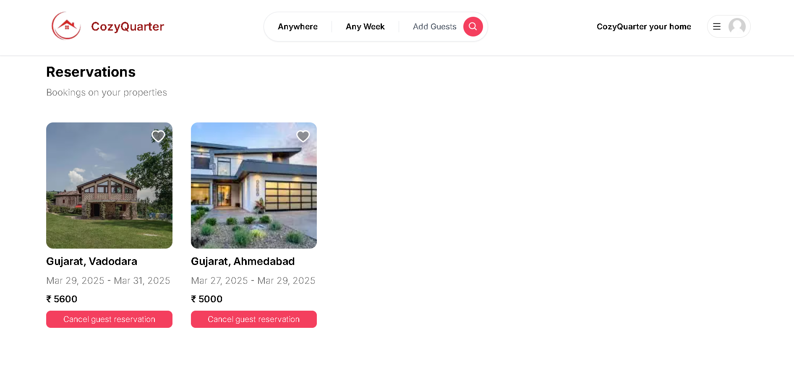
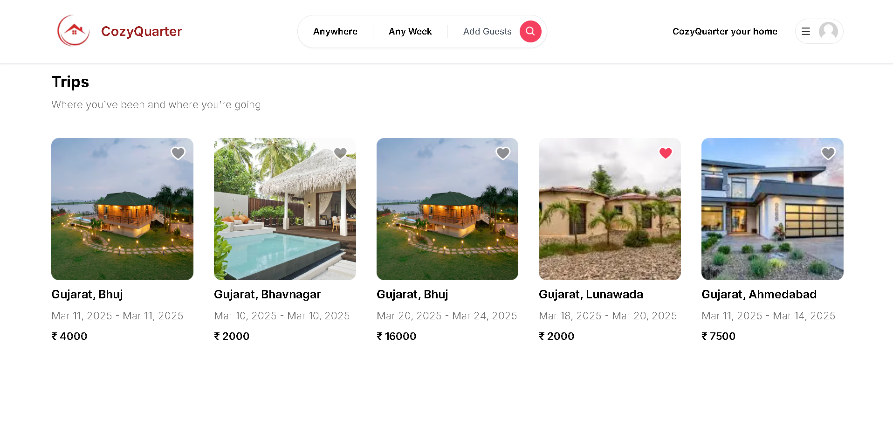
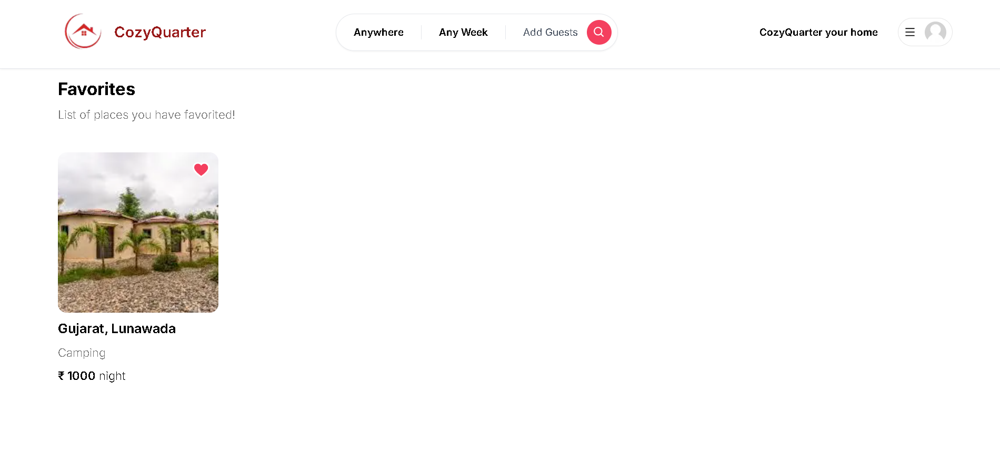

# CozyQuarter - Your Home Away From Home

A modern, user-friendly platform for finding and booking temporary accommodations. Built with Next.js, TypeScript, and Prisma.

## Features

- 🔍 Advanced search with filters
- 🏠 Detailed property listings
- 📅 Real-time availability calendar
- 💳 Secure payment processing
- 👤 User authentication and profiles
- 📱 Responsive design
- 📊 Admin dashboard
- 🔒 Secure authentication

## Tech Stack

- **Frontend**: Next.js 13, TypeScript, Tailwind CSS
- **Backend**: Next.js API Routes, Prisma
- **Database**: MongoDB
- **Authentication**: NextAuth.js
- **Payment**: Razorpay
- **Image Storage**: Cloudinary
- **Deployment**: Railway

## Getting Started

### Prerequisites

- Node.js 18.x or later
- MongoDB
- npm or yarn

### Installation

1. Clone the repository:
   ```bash
   git clone https://github.com/devarshbhatt1235/CozyQuarter.git
   cd cozyquarter
   ```

2. Install dependencies:
   ```bash
   npm install
   # or
   yarn install
   ```

3. Set up environment variables:
   ```bash
   cp .env.example .env.local
   ```
   Edit `.env.local` with your configuration.

4. Set up the database:
   ```bash
   npx prisma generate
   npx prisma db push
   ```

5. Run the development server:
   ```bash
   npm run dev
   # or
   yarn dev
   ```

6. Open [http://localhost:3000](http://localhost:3000) in your browser.

## Project Structure

```
cozyquarter/
├── app/                    # Next.js app directory
│   ├── (auth)/            # Authentication routes
│   ├── (dashboard)/       # Dashboard routes
│   ├── (main)/            # Main app routes
│   ├── api/               # API routes
│   └── layout.tsx         # Root layout
├── components/            # React components
├── lib/                   # Utility functions
├── prisma/               # Database schema
├── public/               # Static assets
└── styles/               # Global styles
```

## License

This project is licensed under the MIT License - see the [LICENSE](LICENSE) file for details.

## Acknowledgments

- [Next.js](https://nextjs.org/)
- [Prisma](https://www.prisma.io/)
- [Tailwind CSS](https://tailwindcss.com/)
- [Stripe](https://stripe.com/)
- [Cloudinary](https://cloudinary.com/)
- [Resend](https://resend.com/)

## Screenshots

### Home Page


### Property Details


### Search Results


### Property Reservation


### Trips Visited


### Favorites Properties

